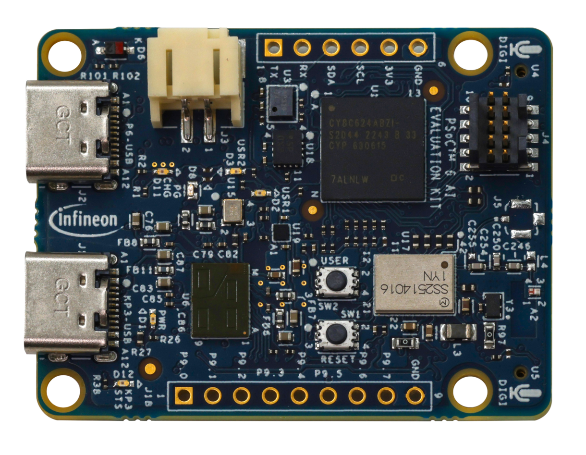
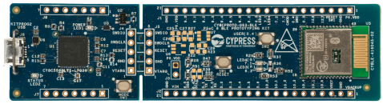
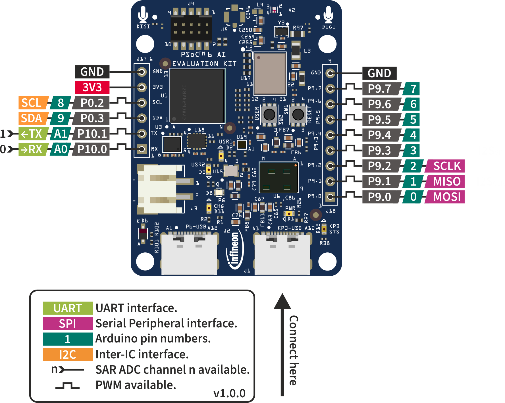
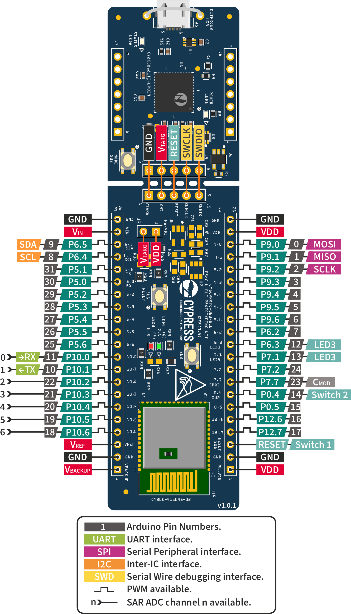

Supported Boards
=================

List of supported PSOC™ 6 boards:

.. list-table::
   :widths: 20 20 50
   :header-rows: 1

   * - Board name
     - Connectivity
     - Special feature 
   * - CY8CKIT-062S2-AI
     - Wi-Fi, BT
     - user button, compact form factor, USB-C, MEMS microphone, radar sensor, pressure sensor, 6-axis IMU, 3-axis magnetometer
   * - CY8CPROTO-063-BLE
     - BLE
     - user button, compact form factor

CY8CKIT-062S2-AI
----------------

CY8CPROTO-063-BLE
------------------

`CY8CKIT-062S2-AI`_

* Name in Arduino IDE: ``CY8CKIT-062S2-AI``
* `Product Page <https://www.infineon.com/cms/en/product/evaluation-boards/cy8ckit-062s2-ai/>`__

Pinout Diagram
^^^^^^^^^^^^^^

`CY8CPROTO-063-BLE`_

* Name in Arduino IDE: ``CY8CPROTO-063-BLE``
* `Product Page <https://www.infineon.com/evaluation-board/cy8cproto-063-ble/>`__

Pinout Diagram
^^^^^^^^^^^^^^^

