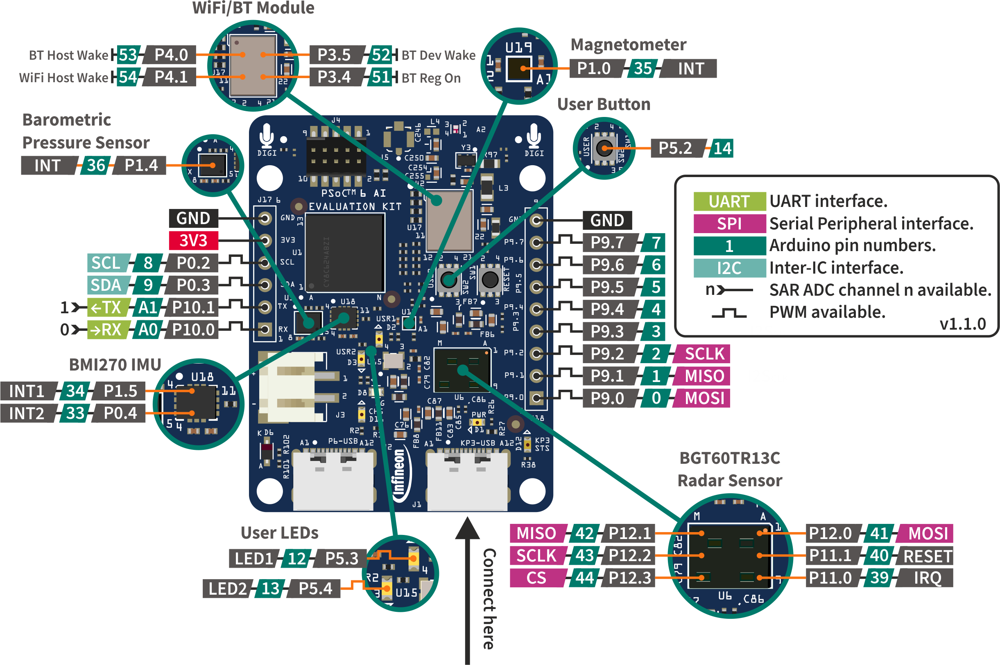

Supported Boards
=================

.. warning::

   This is a work in progress version of the Arduino Core for PSOC™ documentation.
   While this warning notice is present, the documentation is NOT ready for public usage.

CY8CKIT-062S2-AI
----------------

.. image:: img/board_CY8CKIT-062S2-AI.png
    :width: 300

`CY8CKIT-062S2-AI`_

* Name in Arduino IDE: ``CY8CKIT-062S2-AI``
* `Product Page <https://www.infineon.com/cms/en/product/evaluation-boards/cy8ckit-062s2-ai/>`__

Pinout Diagram
^^^^^^^^^^^^^^

