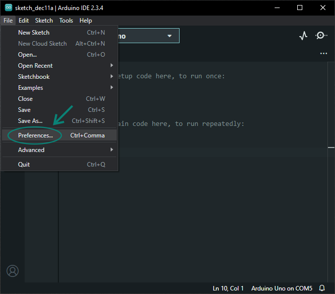
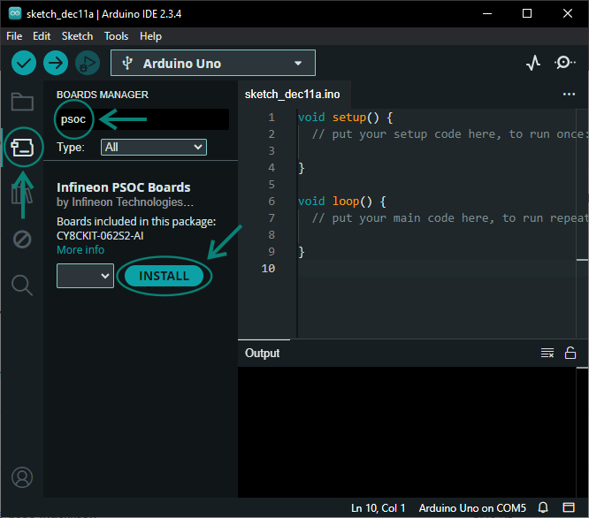
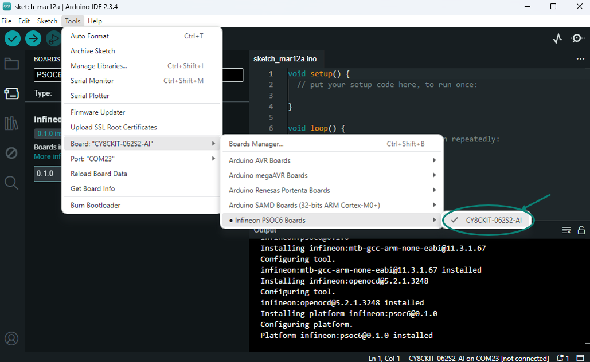

.. _psoc6_core_installation:

Installation Instructions
=========================

.. warning::

   This is a work in progress version of the Arduino Core for PSOC™ 6 documentation.
   While this warning notice is present, the documentation is NOT ready for public usage.

Integration in Arduino IDE
--------------------------
.. note::
    We recommended to use Arduino IDE 2.0 or higher.

Paste the following URL into the *Additional boards manager URLs* input field under *File > Preferences* to add Infineon's PSOC™ 6 microcontroller boards to the Arduino IDE:

::

    https://github.com/Infineon/arduino-core-psoc6/releases/latest/download/package_psoc6_index.json

.. image:: img/install_preferences_json.png
    :width: 600

To install the boards, navigate to *Tools > Board > Boards Manager...* and search for *PSOC6*. Now you can install the Infineon PSOC™ 6 microcontroller boards.
Click *Install* to add the boards to your Arduino IDE. This might take up to 2 minutes.

In the boards list at *Tools > Board > Infineon PSOC6 Boards*, you will now find the supported PSOC™ 6 microcontroller boards.

Installation in Arduino CLI
----------------------------

To install the PSOC™ 6 microcontroller boards using the Arduino CLI, first make sure you have the latest version of the `Arduino CLI <https://arduino.github.io/arduino-cli/0.24/installation/>`_ installed.

Now you can add the Infineon PSOC™ 6 microcontroller boards package to the Arduino CLI:

.. code-block:: bash

    $ arduino-cli core install infineon:psoc6 --additional-urls https://github.com/Infineon/arduino-core-psoc6/releases/latest/download/package_psoc6_index.json

Finally, check if the package has been properly installed by running:

.. code-block:: bash

    $ arduino-cli core list

And... you are ready to develop |:construction_worker:|!
